# OVERVIEW

This project is a course-learning platform similar to Udemy, designed to allow administrators to efficiently manage online courses.
It provides a structured system for creating and organizing courses, chapters, lessons, and quizzes, forming a complete learning workflow.
The platform aims to support scalable online education by giving administrators full control over course content and assessments, while also providing users with a smooth learning experience.

## Features

### Admin Features

1. **Course, Chapters, and Lessons Management (CRUD)**

- Create, read, update, and delete courses
- Create, read, update, and delete chapters
- Create, read, update, and delete lessons

2. **Quiz Management (CRUD)**

- Create, read, update, and delete quizzes
- Create, read, update, and delete quiz questions for each quiz
- Create, read, update, and delete quiz options for each quiz question

### Student Features

1. **Registration & Login**

- Create a personal account to access the platform
- Log in using registered credentials

2. **Profile Management**

- Update personal information such as name
- Change account password

3. **Access Free Courses**

- New users can instantly access available free courses

4. **Paid Courses**

- Users can subscribe monthly or yearly to unlock paid course content

5. **Quizzes**

- Students can take quizzes within lessons to test and reinforce learning

# Setup Instructions

1. **Clone the Repository**

   - ```bash
     git clone https://github.com/JZ23-2/Course-Platform.git
     cd Course-Platform
     ```

2. **Install Dependencies (using pnpm)**

   - ```bash
     pnpm install
     ```

3. **Configure Environment**

   - Create a `.env` file
   - Use the `.env-example` file as reference

4. **Database Migration**

   - ```bash
     pnom drizzle-kit push
     ```

5. **Database Seeding**

   - ```
     pnpm seed
     ```

6. **Start the Development Server**

   - ```bash
     pnpm run dev
     ```

7. **For the easy setup (Optional)**
   - ```bash
     docker compose up -d --build
     ```

## Page Preview (User)

1. **Login Page**
   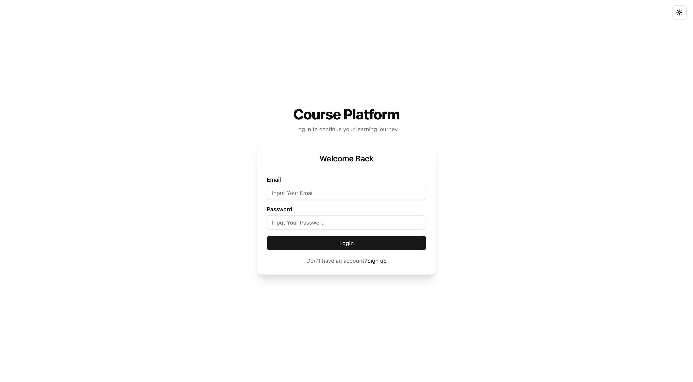

2. **Register Page**
   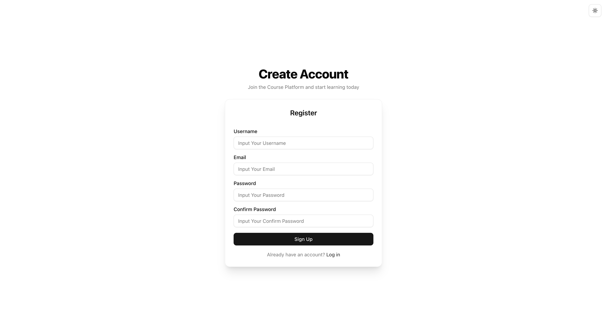

3. **Home Page(Free Plan)**
   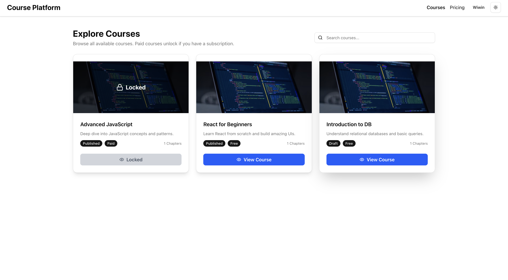

4. **Home Page(Paid Plan)**
   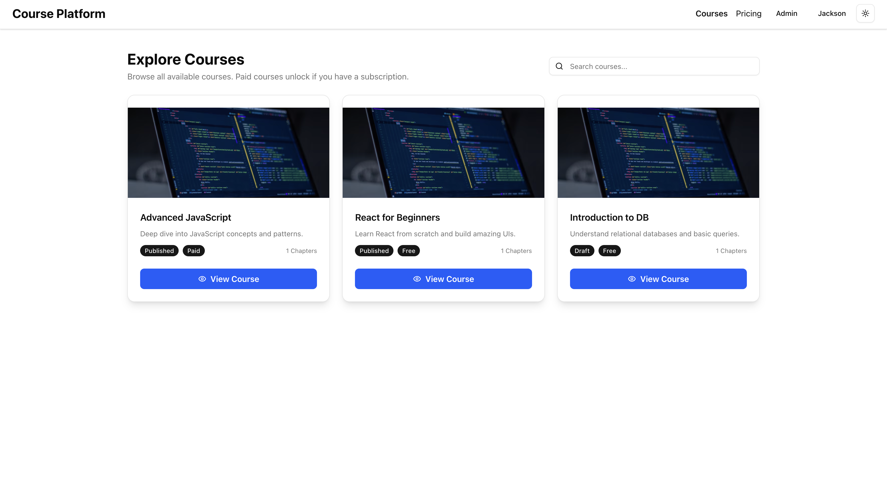

5. **Access Course Detail with Video Lesson**
   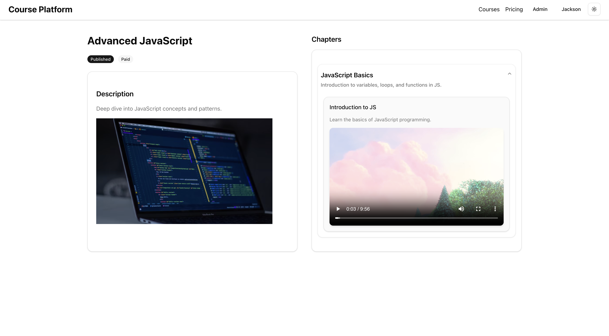

6. **Access Course Detail with Article Lesson**
   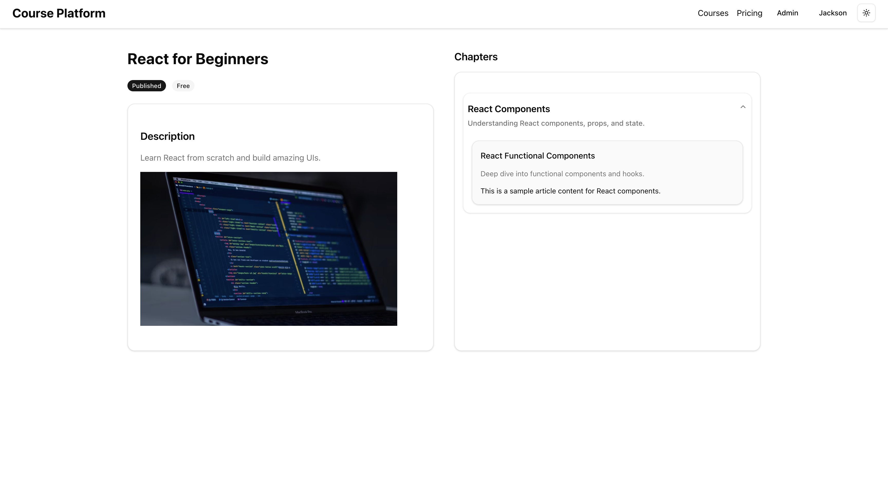

7. **Access Course Detail with Quiz Lesson**
   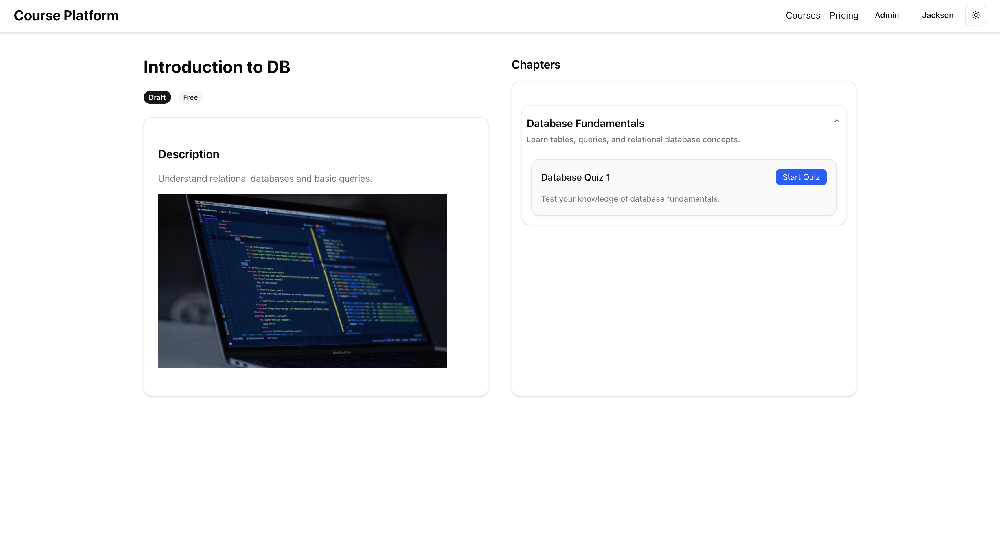

8. **View Profile & Update Profile Page**
   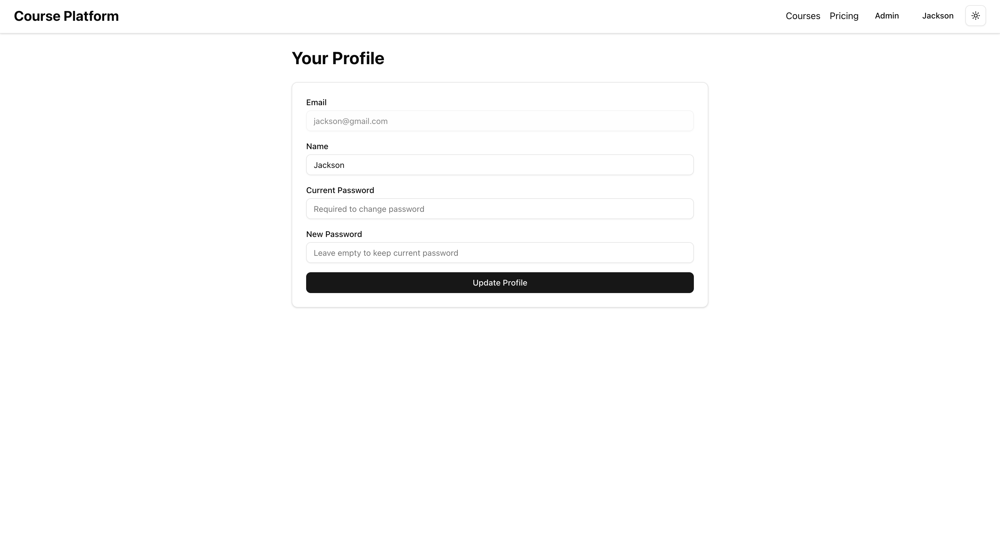

9. **Do Quiz Assignments**
   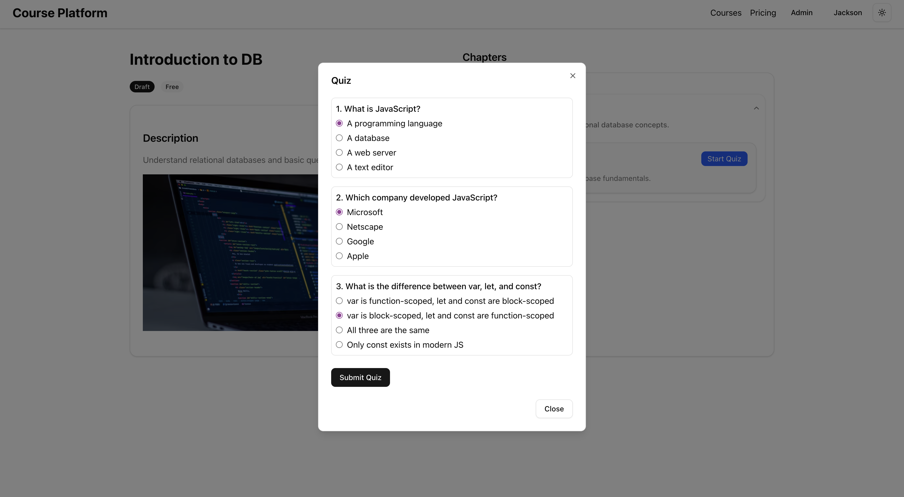

## Page Preview (Admin)

1. Course Admin Page
   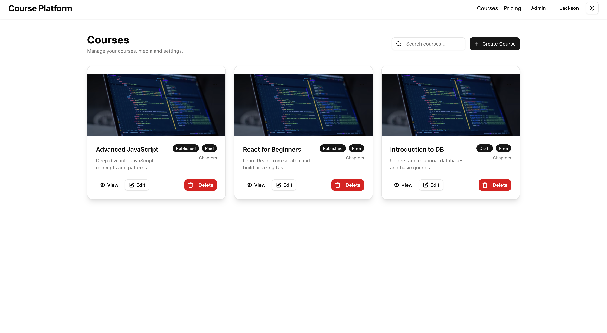

2. Course Detail Admin Page
   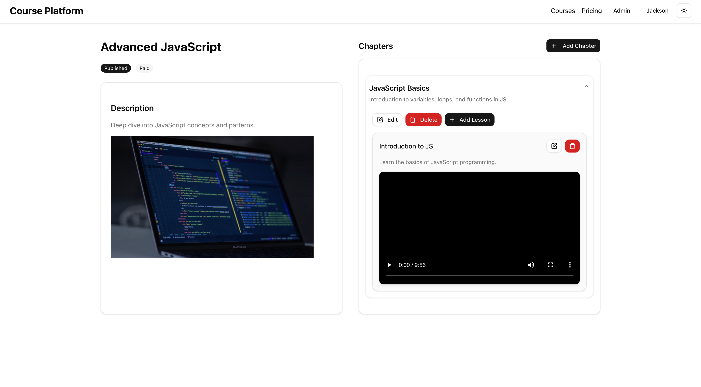

3. Quiz Admin Page
   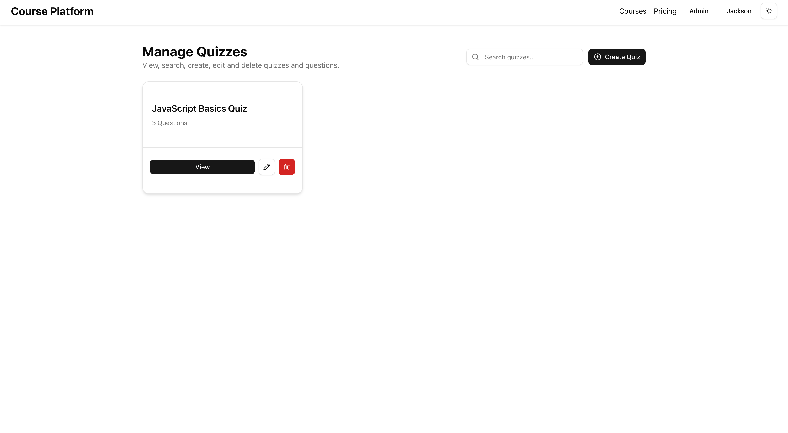

4. Question Admin View
   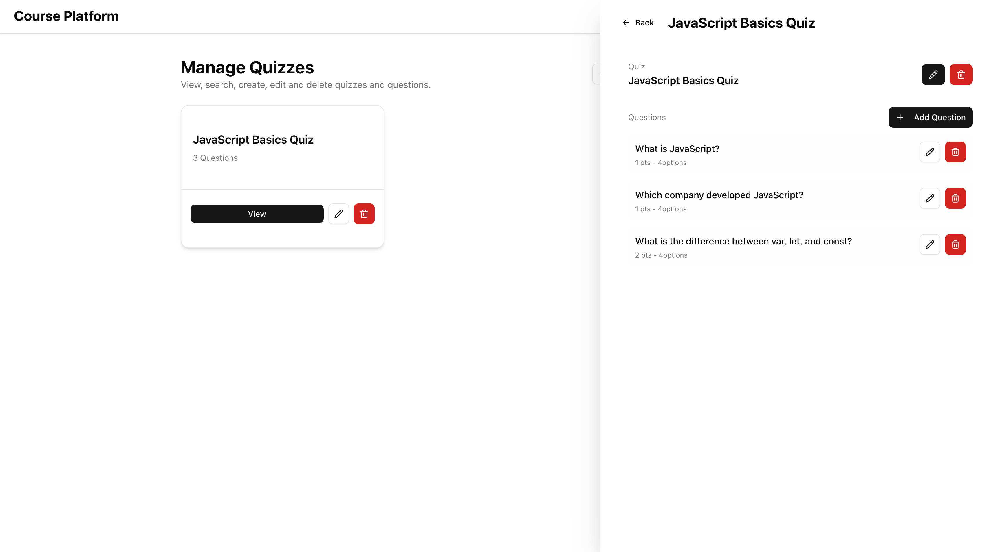

5. Option Admin View
   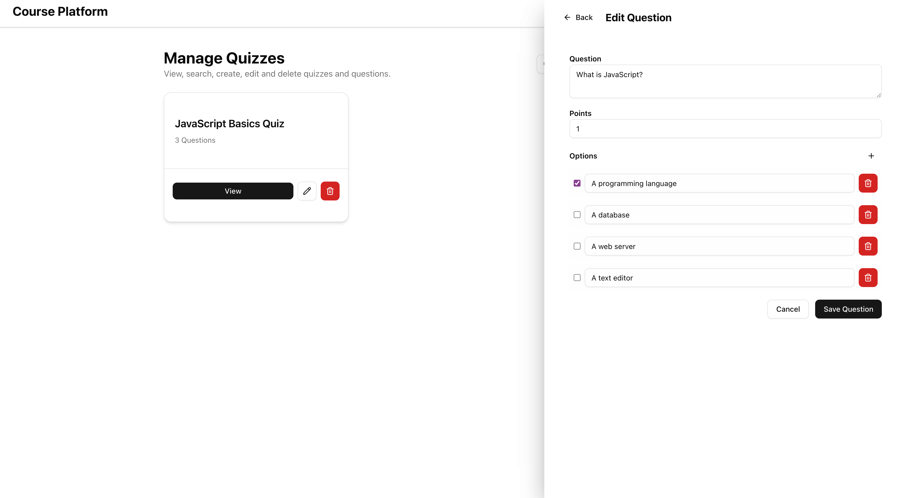


## Known Limitations or Issues

- Setting up the payment gateway requires identity verification (ID submission), which can delay implementation.
- Payment activation may take additional processing time depending on the provider's review process.
